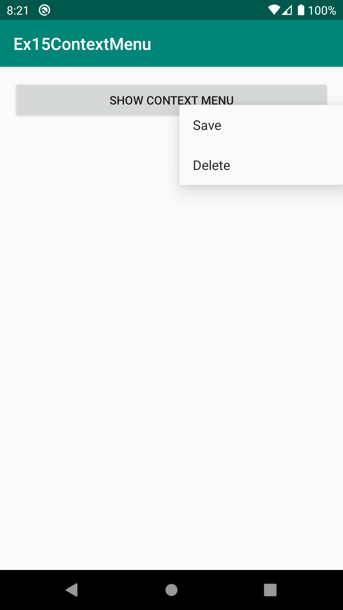

# Ex15ContextMenu
안드로이드 네이티브 앱 개발 수업 예제#15

# 주요코드
ContextMenu 추가하기 [뷰를 꾹~ 누르고 있으면(long click) 팝업되어 보여지는 메뉴 : 데스크탑에서의 마우스 오른쪽버튼 메뉴 역할]

- 메뉴을 추가하고 싶은 뷰(이 예제에서는 Button)을 ContextMunu로 등록(registerForContextMenu())
- ContextMenu를 만들기 위한 메소드 onCreateContextMenu() 오버라이드
- ContextMenu도 OptionMenu만드는 방식과 동일함
- XML언어로 메뉴항목들을 설계하고 자바언어의 MenuItem객체로 만들어서(부풀리다inflate) Menu에 추가하는 방법을 사용함.
    > res폴더>>menu폴더 생성 [ res폴더에서 마우스오른쪽버튼 메뉴에서 'Android Resource Directory' 선택 후 위에서 2번째 항목의 'Resource Type'에서 'menu'선택하면 menu폴더 추가됨]
    > menu폴더에 있는 context.xml문서를 읽어와서 Menu객체로 만들어주는(부풀려주는inflate) 객체인 MenuInflater사용
- ContextMenu의 Menu(MenuItem)클릭 반응하기

# 실행모습

  
  
  

# 실행모습 GIF

  

